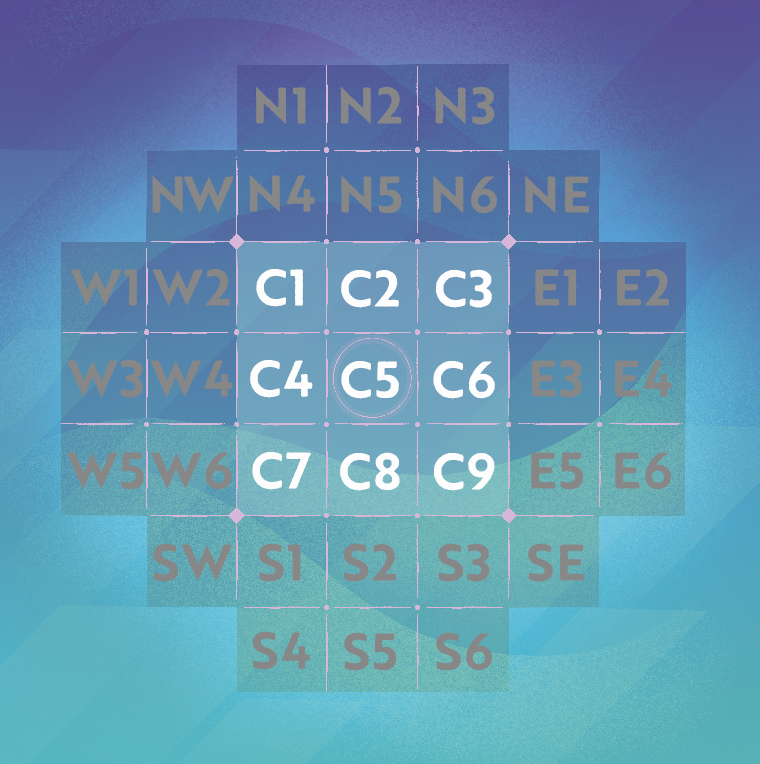

# Philosophy

Philosophy is a board game, the details of which can be found here:
- [Board Game Geek](https://boardgamegeek.com/boardgame/263236/philosophy)
- [Official Rulebook](https://philrulebook.qualitybeast.com/)

Please buy their game; it's a very nice little abstract.

## Usage

```ruby
game = Philosophy::Game.new

# Add players
game << 'Am+:amber'
game << 'In+:indigo'
game << 'Sa+:sage'
game << 'Te+:teal'

# Place pieces
game << 'In:C5PuNo' # See below for notation. Equivalent to:
game << Philosophy::Game::Placement.new(player: :In, location: :C5, tile: :Pu, direction: :No)

# When placing Decisions and Rephrases, you'll need to "complete" the placement.
# You can do this in one action:
game << 'In:C5ReNe[So]' # See below for notation. Equivalent to:
game << Philosophy::Game::Placement.new(player: :In, location: :C5, tile: :Re, direction: :Ne, parameters: [:So])

# or in two:
game << 'In:C5ReNe' # See below for notation. Equivalent to:
game << Philosophy::Game::Placement.new(player: :In, location: :C5, tile: :Re, direction: :Ne)

game << 'So' # See below for notation. Equivalent to:
game << Philosophy::Game::Choice.new(choice: :So)

# The above is also how choosing between possible chain reactions works: you select the space to activate.

# Check for game over
game.concluded? #=> true/false

# Get a machine-parseable serialization of the current board state. (See notation below.)
game.board_state #=> "C2:SaPuEa/E1:AmSrSo"

# Get a list of options the current player has
game.player_options #=> [ :C4, :N6 ]
```

## Notation

I based my notation design off what I was able to find on the [Quality Beast Discord](https://discord.qualitybeast.com) ([here](https://discord.com/channels/404051884131876864/768225424827351100/1079365130195849227)). Each region of the board is named after the cardinal directions, the center is `C`, and the diagonal directions have specific notation, with the numbers ascending as you move left-to-right, then top-to-bottom.

<details>
<summary>Image Names for Board Spaces</summary>

</details>

(In the code itself, this is abstracted away into a coordinate system for the 9x9 grid, but those coordinates aren't exposed.)

Everything is notated as two-character letter codes, abbreviating their purpose.

Each space on the board has a two-character notation.

Player colors (extensible if you really want):
- Indigo (`In`)
- Teal (`Te`)
- Amber (`Am`)
- Sage (`Sa`)

Tiles:
- Push (`Pu`)
- Corner Push (`Cp`)
- Slide Left (`Sl`)
- Slide Right (`Sr`)
- Pull Left (`Pl`)
- Pull Right (`Pr`)
- Long Shot (`Ls`)
- Corner Long Shot (`Cl`)
- Decision (`De`)
- Rephrase (`Re`)
- Toss (`To`)
- Persuade (`Pe`)

Directions: `No`, `Ea`, `So`, `We`, `Nw`, `Ne`, `Se`, `Sw`.

### A Move
Here's an example move: `Te:C7ReNe[We]`

What it means:
- The Player **Teal**
- Placed on the space **C7** (the southwestern corner of the playable region).
- The type of the tile placed is a **Rephrase**.
- The direction it is _targeting_ is **Northeast**.
- The player chooses to set the targeted tile to face **West**.

If the parameter is a decision moving a tile off the board, then the parameter is `OO`. This should be the only circumstance where that is possible.

If a move is incomplete, we leave the right-bracket off, and instead list the options in parentheses:
- E.g., `Am:C2ReNw(EaNoSoWe)` when a Rephrase tile is pointing at a Push tile, but has not decided where the tile should be oriented.
- E.g., `Sa:C9PuNo[E1(C5NE)` when the placed Push tile created a situation between two possible activations, of which `E1` was chosen, but it is a Decision tile, so the resultant position of the tile being decided still needs choosing between `C5` and `NE`.

If a move creates a conclusion, then we notate that with a trailing `.`. If it creates multiple conclusions, we notate each with an additional `.`.

### Player Change
When a player joins or leaves, we can notate that with `In+` or `In-`. This code must be unique at the time of the player joining.

We can optionally specify the full name of the color with `In+:indigo`. This is intended as long-form color name, but can be anything.

You may theoretically do `In+:Charlie;In-;In+:Chris`.

A player concession should be notated as a leave event.

### Game State
This is based very, very loosely off the [Forsythe–Edwards chess notation](https://en.wikipedia.org/wiki/Forsyth%E2%80%93Edwards_Notation).

The board is notated as a description of every occupied space, ordered from C, NW, N, NE, E, SE, S, SW, W, delimited by `/`.

For example, in `C3:SaSlNo/C5:InSrNo/E1:InDeNw`, there are 3 occupied spaces: C3, C5, and E1.

Then we add player options, if we're in the middle of a placement, as a sorted list of options wrapped in parentheses (or a `-` if empty), and then the currently active player code. E.g.,

```
C2:InReSw/C3:TeSrNo/C4:TePuSo/C5:SaPuEa/E3:InDeSw - In
```

### The Respect Token
Notated simply with `R:In` to pass it to the Indigo player.

### Rule Change
If you want to change the rules mid-game, you can issue a Rule Change. Example notation:
- E.g. `rule:join:permitted:between_turns`
- E.g. `rule:leave:effect:remove_their_tiles`

## Rule Variations

You should be able to create a game with rule variations thus:
```ruby
Philosophy::Game.new(rules: {
  join: { permitted: :between_turns, where: :after_a_full_turn },
  leave: { permitted: :never, effect: :remove_their_tiles }
})
```

### Joining
- When can a new player join a game?
  - `:only_before_any_placement` (default) - Before any tiles have been played.
  - `:between_turns` - Anytime there isn't a placement in progress.
- Where in the turn order is a new player inserted?
  - Note that this rule is ignored for joins before game start.
  - `:immediately_next` (default) - The new player will place the next tile.
  - `:after_a_full_turn` - Every previous player will have the chance to play a tile first.

### Leaving
- When can a player leave the game?
  - `:only_before_any_placement` (default) - Players can only leave if the game hasn't started.
  - `:never` - Joined players may not ever leave.
  - `:anytime` - Joined players may leave at any point.
- What effect is had on the board when a player leaves the game?
  - `:ends_game` (default) - The game if forced to end if a player leaves. No further tiles may be played.
  - `:rollback_placement` - If the player was in the middle of placing a tile or activating chain reactions, those decisions are rolled back such that the player never placed a tile.
  - `:remove_their_tiles` - All the tiles the player has played are removed from the board, clearing space.

## Portable Game Notation (PGN)
[Portable Game Notation](https://en.wikipedia.org/wiki/Portable_Game_Notation) was invented for chess, but the basic format is entirely usable for pretty much anything. Therefore, I stole the metadata tag pair format.

The following can be used to preset the names for colors, as well as rules. This interacts poorly with mid-game changes in player names and rule variations, but hopefully that won't come up anywhere it'll be an issue. If there's a tournament setting, you should really not be making changes to rules and players mid-game; if this handling dynamic play simulating people entering and leaving a conversation, then metadata instability should be very excusable.
```
[ColorAm "Ambrose Bierce"]
[ColorIn "Indiana Jones"]
[ColorTe "Teotihual Batan"]
[ColorSa "Sarah Connor"]
[JoinPermitted "Between Turns"]
[LeaveEffect "Remove Their Tiles"]

1. In+
2. Am+
3. Te+
4: Sa+
```

Serialization and deserialization:
```ruby
game = Philosophy::Game.from_pgn(pgn)
game.to_pgn
```

## To-do

- [x] Handle the game over conditions better.
  - [x] If there are multiple conclusions, the game is supposed to continue, so #concluded? is technically the wrong API. (Added a note on how to notate multiple conclusions.)
  - [ ] The "full board" and "empty hand" states aren't accounted for.
  - [x] There should be notation for conceding. This should just be "player leave".
- [x] Formalize and implement rules about:
  - This is just because *I* want these things, not because they're part of the published rules.
  - [x] Joining a game midway
  - [x] Leaving a game midway (what if the leaving player is next?)
    - If the leaving player is the second-to-last, then game goes on-hold, as far as the code cares.
      The remaining player can be declared winner by someone else.
  - [x] What happens if a placement is in progress?
  - [x] A rule-change mechanism is honestly probably useful, too.
- [x] Figure out a way to preload the four player colors.
  - Probably easiest to do via PGN metadata?
  - [ ] It'd be neat to match colors with actual colorspace definitions.
  - [x] It'd be nice to actually assign names to players, too.
- [x] Oh yeah, actually get my PGN parser in here.
- [x] Figure out how to convert Game::Placement into notation safely.
  - [x] Figure out how to roll Game::Choice events back into Placements.
- [ ] Generate a correct game object from the full state notation.
  - That might not work for players, since you can't reliably guarantee what players are present from the board state. Maybe I should add the current player list to the state notation?
